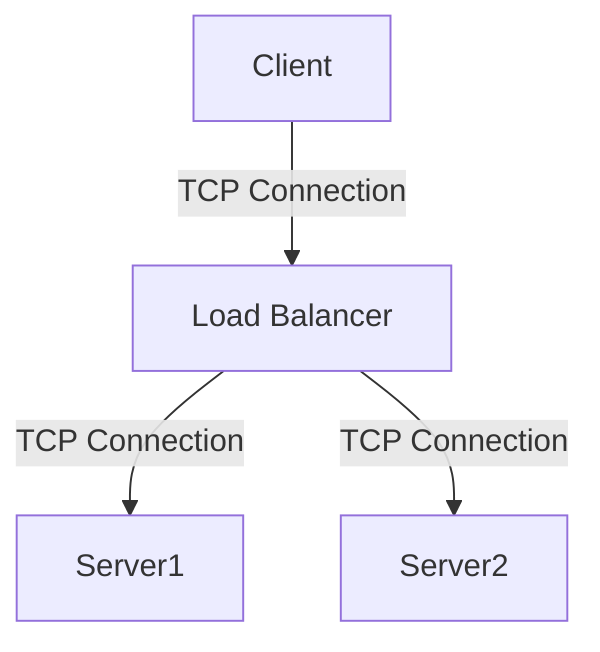

# My Presentation

## With Mermaid Diagrams

I can't seem to get this demo to work.
The mermaid: true above is not neccessary.
The `.marprc.js` file is not neccessary as well.

graph TB
    A[Web Browser] -->|HTTP| B[Load Balancer]
    B --> C[Web Server 1]
    B --> D[Web Server 2]
    C --> E[Database]
    D --> E

