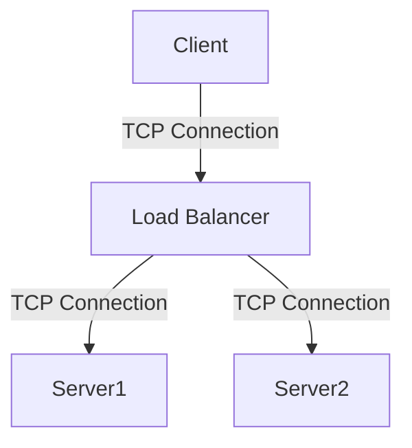
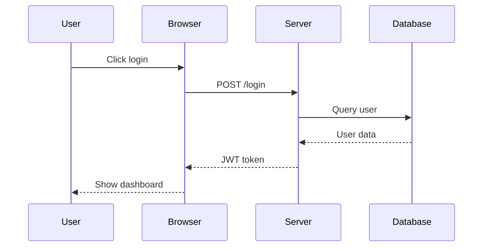
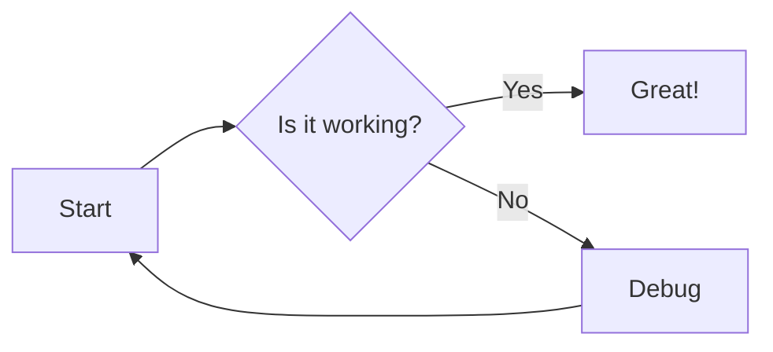

<!-- NOTE: This demo does NOT render correctly in Marp.
     Marp does not support ```mermaid fenced code blocks.
     Use <div class="mermaid"> with a <script> tag instead.
     See mermaid_internal.md for a working example. -->

# Mermaid Code Block Demo

## Using ` ```mermaid ` Syntax

This demonstrates Mermaid diagrams using fenced code blocks.



---

## Sequence Diagram



---

## Flowchart


